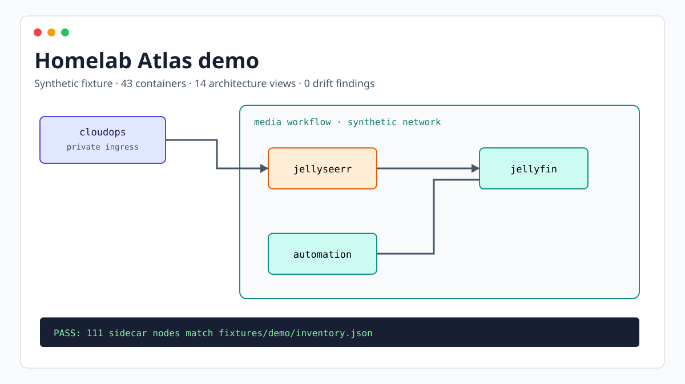
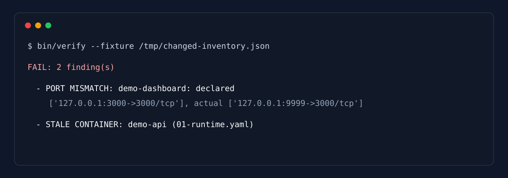

# Homelab Atlas

Homelab Atlas keeps architecture diagrams readable by hand and checks the facts beside them with code. Mermaid files define the layout. YAML sidecars map diagram nodes to container, network, systemd, timer, port, and subnet identifiers. The verifier reports objects missing from the diagrams, stale nodes, and changed network details.

This public repository contains a sanitized representative topology: 43 named services, four synthetic networks, three application units, four timers, and 14 architecture views. Public product and project names are retained so the workflows are useful. Real hostnames, host-specific addresses, private paths, account data, runtime observations, and the original inventory structure are not included. Addresses in the demo are reserved synthetic ranges or loopback examples.



## Why this pattern works

Automatic topology graphs tend to become crowded. Handwritten diagrams communicate intent better, but they can silently become stale. Atlas separates those concerns:

- `src/*.mmd` contains the presentation and relationships.
- `src/meta/*.yaml` contains the identifiers a machine can compare.
- `fixtures/demo/inventory.json` stands in for discovered host state.
- `bin/verify` fails on drift in either direction.
- `bin/render` writes only below this repository's `out/` directory.

The production design reads host state with fixed, read-only command prefixes. Those exact prefixes are the primary control. It invokes commands with `shell=False` and also rejects shell metacharacters and known destructive verbs as defense in depth. Tests cover restart, compose, removal, and command-substitution attempts.

## Try the safe demo

Python 3.12 is required. The demo neither calls Docker nor reads systemd.

```bash
git clone https://github.com/arkhiVd/homelab-atlas.git
cd homelab-atlas
python3 -m venv .venv
.venv/bin/pip install -e '.[dev]'
.venv/bin/python -m atlas.cli verify
.venv/bin/python -m atlas.cli render
```

Open `out/atlas.html`. The renderer copies the pinned Mermaid 11.16.1 runtime into `out/`, so the diagrams work offline. To prove the drift gate works, copy the fixture and remove `jellyfin` or change a declared port, then run:

```bash
.venv/bin/python -m atlas.cli verify --fixture /tmp/changed-inventory.json
```

The command exits nonzero and identifies the stale node or port mismatch.



Live discovery is opt-in because it reads local Docker and systemd state:

```bash
.venv/bin/python -m atlas.cli verify --live
```

The bundled sidecars describe the demo, so this command normally reports your host as drift. Fork the repository, define your inventory scope, then replace the synthetic sidecars before using live mode as a gate.

## Reproducible validation

```bash
PATH="$PWD/.venv/bin:$PATH" bin/validate
```

The gate checks formatting, lint, tests, fixture drift, render idempotency, and whitespace errors. CI also runs Gitleaks and CodeQL.

## Applying the pattern to a real homelab

1. Keep discovery separate from diagram layout. Normalize read-only command output into an inventory structure.
2. Start with a context diagram, then add runtime, ingress, storage, and operational flows only when each view answers a different question.
3. Give every real object one sidecar entry with the identifier reported by the host.
4. Fail on both undocumented live objects and documented objects that disappeared.
5. Keep command and output-path allowlists in code. Do not rely on comments or operator intent.
6. Test refusal paths before connecting discovery to a host.
7. Generate only into repository-owned or explicitly configured destinations.

`atlas.core.run_read_only` is the guarded command boundary. The public CLI uses fixtures by default so a first run cannot inspect or alter the reader's machine. Adapting live discovery is intentionally left as an operator integration task because unit naming and inventory scope differ between homelabs.

## Repository map

```text
atlas/          verifier, safety guards, and renderer
bin/            convenience commands
fixtures/demo/  synthetic discovered state
src/            Mermaid sources and YAML sidecars
tests/          drift and negative safety tests
docs/           screenshots made from synthetic data
.github/        CI, CodeQL, Gitleaks, and Dependabot
```

Read [SECURITY.md](SECURITY.md) before adding live discovery or new render destinations. The behavior contract is in [SPEC.md](SPEC.md).

## License

MIT. See [LICENSE](LICENSE).
